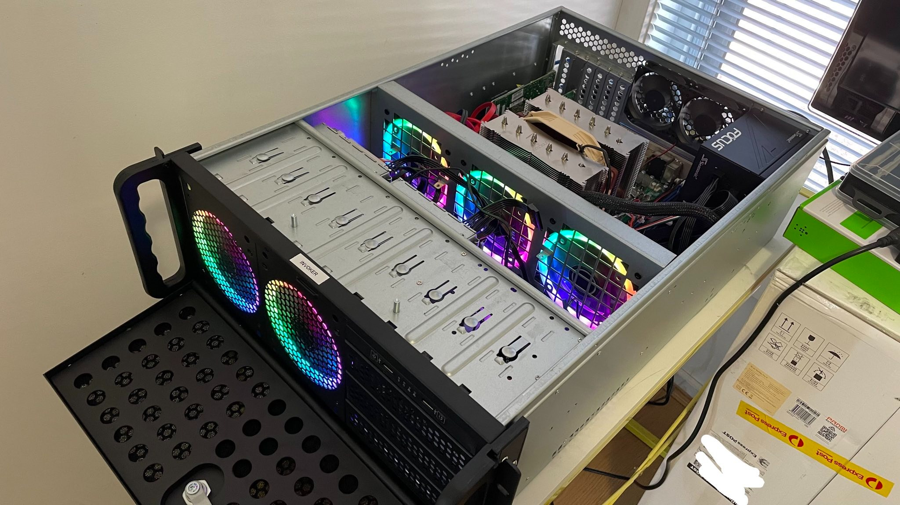
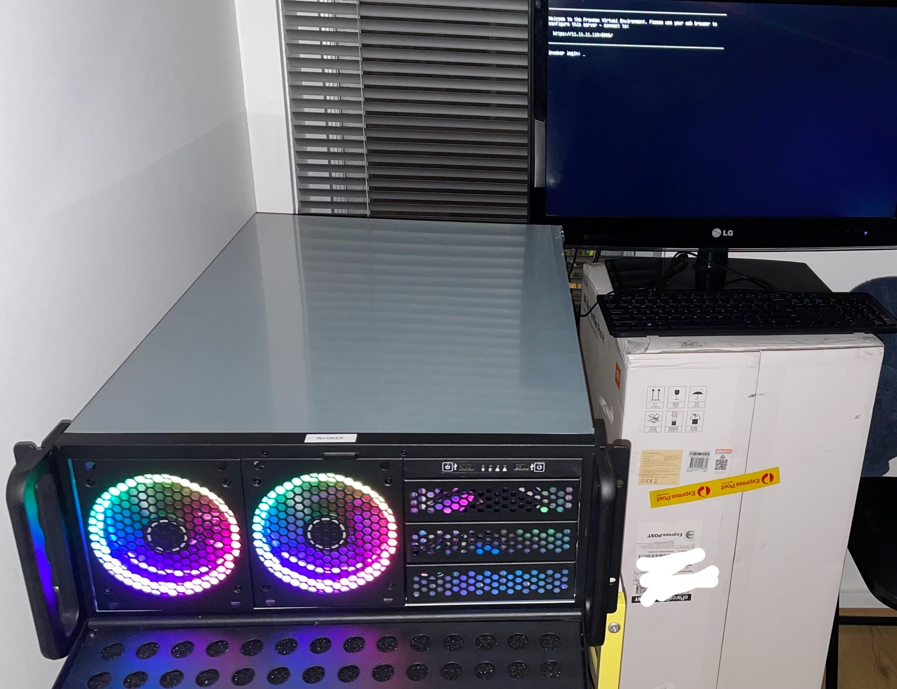

> ***Hello Mate!***

I'm currently working on self hosted home server project with various open-source applications that I use everyday and not rely on just few big companies with my data.

I would like to have as much control as possible in regards to data and its privacy, security by using as many open sources software as I can and self-hosted them by myself at home or on a remote private server. 

I plan on doing this on the go over the next 1-2 years while learning various things like setting up home-lab, Pihole, Pfsense, VPN to access from outside, Nextcloud file sync & share, FreeNAS on single server with nested virtualization and using docker containers and accessing them remotely via Open VPN.

I will be linking all the projects below to blog post with detailed setup later on.

Current projects :

* This website, update as much as I can to keep track of my projects and share it with others.
* Configure a monitoring tool like Grafana loki and Zabbix or other tools.
* Segment my network further with VLANs and Test wireguard VPN and implement Suricata, on Pfsense.
* Setup Ngnix proxy manager with use SSL certificates on local network for all devices.
* Migrate TrueNas to new dedicated server.
* Encrypted data backup solution.

Planned:

* UPS monitoring tools, Money management tracker.

Finished:

* Browser privacy and security setup using Firefox containers and other plugins.
* Setting up CalDev, CardDev for my Calendar and Contacts.
* Private email setup and using alias and relay domains.
* Self-host encrypted notes taking app for building my KB.
* Daily drive Ubuntu.

But, Isn't this too much work and waste of time? Nope! This is what i like doing in my free time all the time and keep myself busy :p